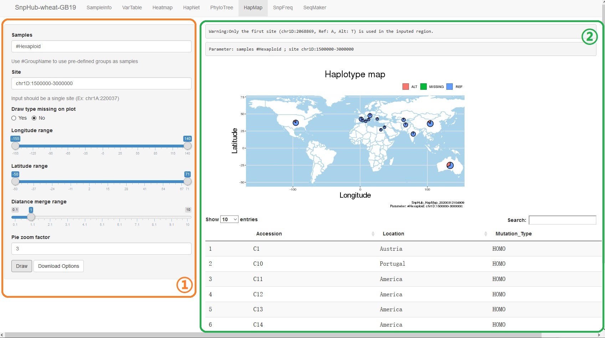
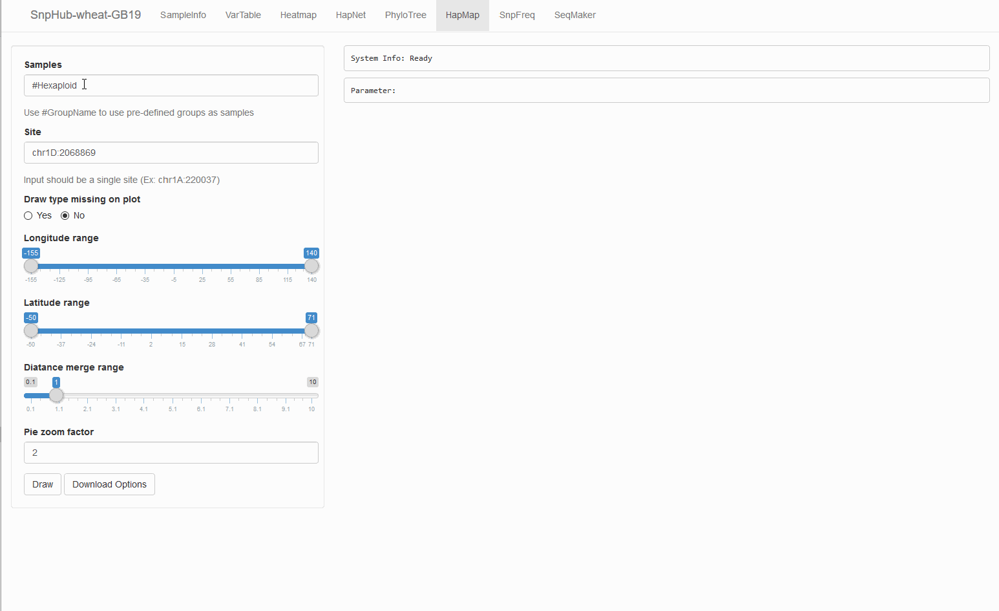

# HapMap, visualize the genotypes geographically

The **`HapMap`** channel provides a way to project the allele distribution of a single site geographically on a map, utilizing the provided resource-gathering locations.

## Panel ① on the left provides several options:
- **Samples**:The textbox titled "Samples" inquiry a sample list for querying. Three styles are supported for the sample-list input box, which are 
`list of sample names (Accession name according to the “SampleInfo” channel)`, `use group IDs with "#"` and `mixture`. For more details, please read [the overview section](/content/Basic_Usage/overview.html).

- **Site**: A specific genomic site is required for the querying input boxes, such as "`chr:pos`".
	- If a genomic region is provided, such as "`chr:posA-posB`", the first variantion site within the region will be used.

- **Longitude range**: To adjust the maximum and minimum limitations of the longitude to be shown on the map.

- **Latitude range**: To adjust the maximum and minimum limitations of the latitude to be shown on the map.

- **Distance merge range**: Coefficient of the merge range. Users can select the proper distance for merging geographically closely distributed accessions in one circle. Larger the coefficient will merge more geographically closed sample together, leaving with fewer points on the map.

- **Draw**: Click for action when getting all options ready.

## Download Options

Click the **Download Options** button, and then you can select downloading format (`PNG` or `PDF`) of figure, and specify the width and height to appropriate presentation.

Then, click `Download` to download the figure.

## Demonstration

