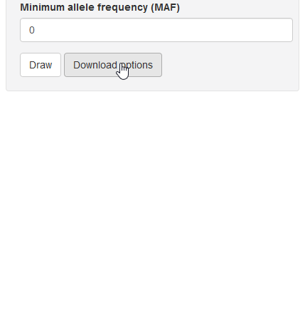
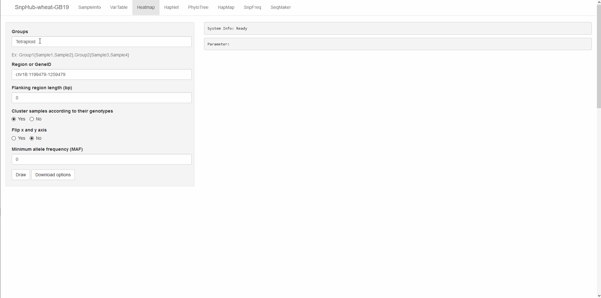

# Heatmap, visualize genotypes in matrix

The **heatmap** channel provides a way to visualize genotype variations across multiple samples in an intuitive interface. Through the heatmap, it's easy to figure out the mutation patterns or haplotypes and variation types.

Different colors are used to represent the `homozygous mutations` (dark blue), `heterozygous mutations` (light blue), `reference genotypes` (grey), and `missing data` (white). The annotated variation function and gene-based location information of each position are also shown as two heatmap vectors. The annotated variation functions include `missense variations`, `synonymous variations`, `frameshift_variant`, `stop_gained/stop_lost` et al. That mutations located in `genebody` and `intergenic` regions are also distinguished by different color in another annotation track. Additionally, the chromosome and position are also shown for each variation site.

When the queried samples are in different groups, each group of samples will be displayed in separated block, to help to compare haplotypes between the groups.

## Panel ① on the left provides several options as following:
- **Groups**: The textbox titled "Groups" inquiries a list of group IDs. Both `pre-defined group` and `user-defined group` styles are supported. For more details, please see [the overview section](https://esctrionsit.github.io/snphub_tutorial/content/Basic_Usage/overview.html).

- **Region or GeneID**: The textbox titled "**Region or GeneID** inquire the input for querying genomic regions. The input text shall be in form of `chr:from-to`. For example, `chr1A:1-100`. Also, gene name is acceptable.

- **Flanking region length**: When using the gene name as input, you may want to extend the regions. It is usually `0` bp in the box by default, indicating no flanking region is considered. If `2000` is provided in this input box, then the flanking regions in length of "2000bp" will be included for both upstream and downstream.

- **Cluster samples according to their genotypes**: The two options `Yes` and `No` represent "cluster samples within each group according to their genotype similarity" and "not to cluster samples within each group according to their genotype similarity".

- **Flip x and y axis**: By default, genomic positions are displayed in rows, and samples are displayed in columns. The option `Yes` indicates "to transform the two dimensions".

- **Minimum allele frequency (MAF)**: Minor allele frequency (MAF) is the frequency at which the second most common allele occurs in a given population. Higher MAF threshold will result in fewer sites left. If the value is `0` (by default), this filter function is disabled, and no position will be filtered by MAF.

- **Draw**: Click for action when getting all options ready.

## Download Options

Click the **Download Options** button, and then you can select downloading format (`PNG` or `PDF`) of figure, and specify the width and height to appropriate presentation.

Then, click `Download` to download the figure.

## Demonstration

