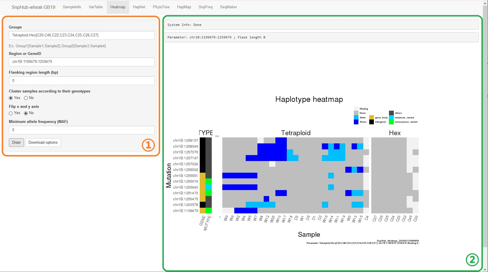
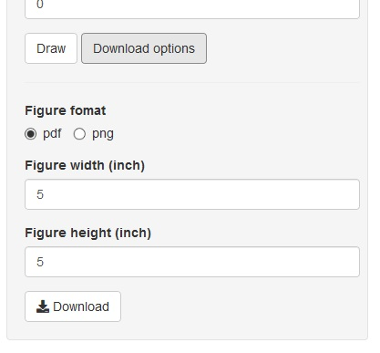

# Heatmap

The parameters of the two dimensions can be exchanged. Different colours are used to represent homozygous mutations, heterozygous mutations, reference genotypes, and missing data. To be more intuitively visualize possible haplotypes, samples are clustered within each group according to their genotype similarity. This function can be useful for exploring group-specific haplotypes or genotype patterns.

## Panel ① on the left provides severial options:
- **Groups**: samples that divided into group(s) are wanted. Three ways are avaliable as well.
	- Pure sample name group list. Assume that we have samples `S1,S2,S3,S4`, and `S1,S2` are in a group called `G1`, while `S3,S4` in `G2`, a string like `G1{S1,S2},G2{S3,S4}` could be used as an input.
	- Pure group list. Assume that we have two pre-defined groups called `PG1` and `PG2`, a string like `PG1,PG2` could be used as an input.
	- Mixed list. String like `G1{S1,S2},PG1,PG2,G2{S3,S4}` is also able to use as an input.
	- **Make sure** that `S1`, `S2`, `S3` and `S4` should **NOT** be contained in neither `PG1` nor `PG2`.

- **Region**: a region is wanted here. Input format should be `chr:from-to`, like `chr1A:1-100`. You could find all the avaliable chromsomes and their maximum length in `SampleInfo` panel. Also, gene name is acceptable.

- **Flanking region length**: when using the gene name as input, you may want some extra length in the upstream and downstream. Both ends of the region will be extended by the value here.

- **Minimum allele frequency (MAF)**: Minor allele frequency (MAF) is the frequency at which the second most common allele occurs in a given population. Larger the value is, lesser the result postions are. If the value is 0 (by default), this filter function is disabled.

- **Draw**: click when getting all options ready.

## Download Options

Click the **Download Options** button, and then you can select format, width and height of the plot shown as the result. Then, click `Download` to download it.
