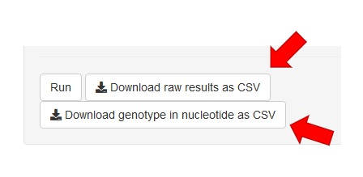

# Overview

In this section, we would like to introduce the main functions supported by `SnpHub`.

When you open a `Snphub` instance in your browser, you would see the page as below.


Basically, the whole page is composed of two parts: "*menu*" part and "*workspace*" part.
- ①: *Menu*: users can select different channels of SnpHub here.
- ②: *Workspace*: each channel corresponds with specific content panel, providing the interfaces for interactively exploring the data set. The left sub-panel provides boxes or menus for specifying input parameters. Results in forms of tables or figures will be display in the right sub-panel.

## Basic Input Boxes

### The input box: "Samples"

The textbox titled "Samples" inquiry a sample list for querying. Three styles are supported for the sample-list input box.
- A list of sample names (Accession name according to the “SampleInfo” channel), separated with comma ",". Example:
```text
sample1,sample2,sample3
```
	- *Tips: User can save frequently queried sample lists in their own NotePad.*
- Use group IDs. The system manager could define groups of samples and gave the GroupIDs as identifiers for these sample lists. Information of pre-defined groups could be found in the “SampleInfo” channel. Use a *#* before group name to transfer group into sample name list. Example:
```text
#PredefinedGroup1,#PredefinedGroup2
```
	- **Note:**  **#ALL** is a **RESERVED** group ID contains all the samples in this dataset
- Mixture. You can combine both sample names (Accession IDs) and group IDs. For the mixture style, SnpHub frameworks will expand the GroupIDs as lists of samples. Examples:
```text
sample1,sample2,sample3,#PredefinedGroup1
```


### The input box: "Groups"

The textbox titled "Groups" inquiries a list of group IDs, rather than a list of samples. Channels with the “Groups” input box usually perform inter-group analysis, and support inter-group visualizations. Both pre-defined group and user-defined group styles are supported. 
- Predefined Groups. The pre-defined groups are listed in “SampleInfo” channel, and are supported to be maintained by the system manager. For the “Groups” input box, you shall only input the group IDs, WITHOUT putting “#” ahead of the IDs. The list of group IDs shall be separated by comma “,”. For examples:
```text
PredefinedGroup1,PredefinedGroup2,PredefinedGroup3
```
	- **Note:**  **ALL** is a **RESERVED** group ID contains all the samples in this dataset.
- User-defined Groups. Sometimes, the users would expect to define their own groups of samples, without bothering the system manager. SnpHub supports user-defined group, in form as the following. Put the **GroupID** ahead of {}, and list the group of samples in {}.
```text
MyGroupA{Sample1,Sample2,Sample3}
```
- To define multiples groups, users can define each group as above, and seprate by comma (,). The groups should be given different Group-IDs (should also be different with predefined group-IDs by system manager). For example:
```text
MyGroupA{Sample1,Sample2,Sample3},MyGroupB{Sample8,Sample9,Sample10}
```
- Also, the SnpHub supports the mixture styles, such as
```text
MyGroupA{Sample1,Sample2,Sample3},PredefineGroup1,PredefineGroup2,MyGroupB{Sample8,Sample9,Sample10}
```


### The input box: "Region or GeneID"

The textbox titled "**Region or GeneID** inquire the input for querying genomic regions. The input text shall be in form of `chr:from-to`. For example, `chr1A:1-100`.

It is noted that the chromosome IDs shall be concordant with the chromosome IDs listed in "*SampleInfo*" channel. The valid ranges for each chromosome (total length in base pairs) is also available in "*SampleInfo*" channel.

The gene-IDs is also supported, too. When a gene-ID is provided, the system will resolve it as real location according the gene-annotation information (provided by the administrator when setting-up the instance).

*Users can also specify the flanking regions of a gene (or a given region), through the input box "Flanking region length (bp)". It is usually `0` bp in the box by default, indicating no flanking region is considered. If `2000` is provided in this input box, then the flanking regions in length of "2000bp" will be included for both upstream and downstream.*


## Basic Output Functions

### Download Tables

The button named `Download raw results as CSV` or `Download genotype in nucleotide as CSV` in channel `VarTable` will start downloading the table showing on the right of the page. The former will download an original table as `.csv` format, while the latter will download a table that contains genotype like `A/A` instead of `./.`.



### Download Figures

In channels that use plot as the output, you could find the button `Download Options`.

At the first time clicking the button, the downloading options will appear. They will hide again by another click.


You can choose the file format between `.png` and `.pdf` (`.pdf` format is in vector graph format that can be nondestructive modified by tools such as *Adobe Illustrator*). User can also resize the figure by modifying the height and width of output graph.

### Download sequences

In channel `SeqMaker`, results could be downloaded as `FASTA` format by clicking button named "`Download as fasta`".
