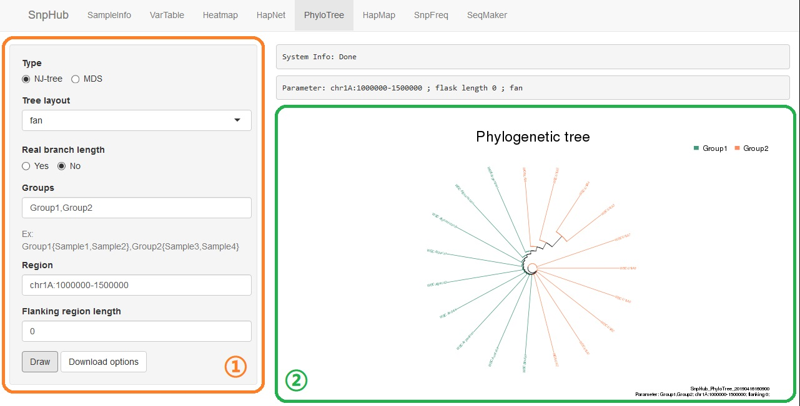
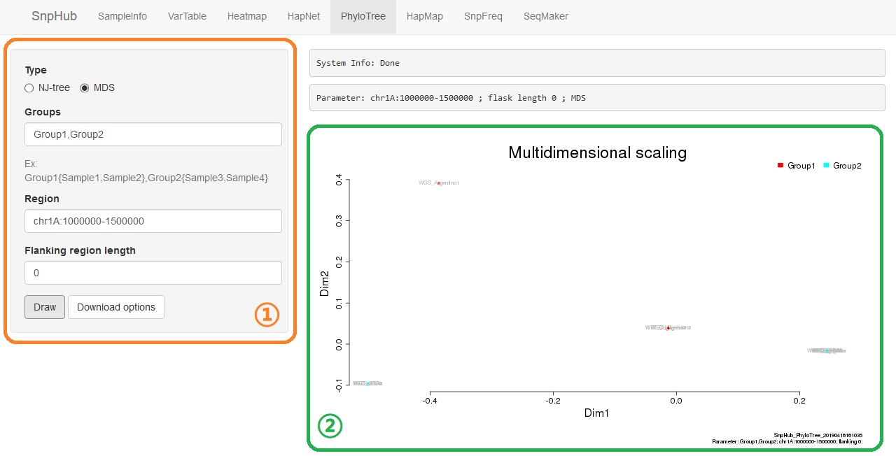
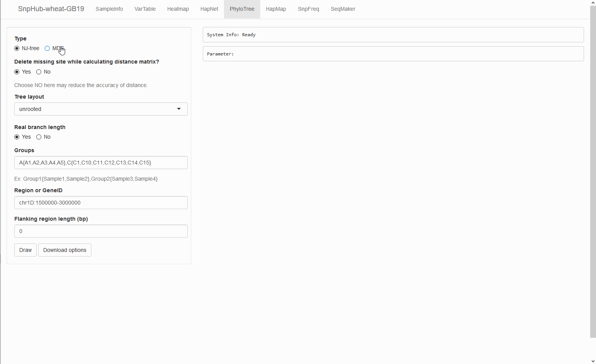

# PhyloTree

There're two kinds of output in this function, which are NJ-tree and MDS (multidimensional scaling). The former, clearly, is the [phylogenetic tree](https://en.wikipedia.org/wiki/Phylogenetic_tree) made by [neighbor joining](https://en.wikipedia.org/wiki/Neighbor_joining) algorithm. And the latter is multidimensional scaling, which presents the relationship in the second dimension by the distance on the graph.

## Panel ① on the left provides several options:
- **Type**: choose to draw a phylogenetic tree or a multidimensional scaling plot.

- **Tree layout**: if `NJ-tree` is chosen as the plot type, this option would appear. Select a tree layout here.

- **Real branch length**: `real branch length` means the length of branch presents exactly how far the sample from each other. However, some times the real distance between samples is not that important, and you just want to see the relationship or just want to make a beautiful plot, in this situation, just click `No`. 

- **Groups**: samples that divided into group(s) are wanted. Three ways are available as well.
	- Pure sample name group list. Assume that we have samples `S1,S2,S3,S4`, and `S1,S2` are in a group called `G1`, while `S3,S4` in `G2`, a string like `G1{S1,S2},G2{S3,S4}` could be used as an input.
	- Pure group list. Assume that we have two pre-defined groups called `PG1` and `PG2`, a string like `PG1,PG2` could be used as an input.
	- Mixed list. String like `G1{S1,S2},PG1,PG2,G2{S3,S4}` is also able to use as an input.
	- **Make sure** that `S1`, `S2`, `S3` and `S4` should **NOT** be contained in neither `PG1` nor `PG2`.
	- **Make sure** that the samples in total should **NOT** less than 3, or the tree couldn't be built.

- **Region**: a region is wanted here. Input format should be `chr:from-to`, like `chr1A:1-100`. You could find all the available chromosomes and their maximum length in `SampleInfo` panel. Also, gene name is acceptable.

- **Flanking region length**: when using the gene name as input, you may want some extra length in the upstream and downstream. Both ends of the region will be extended by the value here.

- **Draw**: click when getting all options ready.

## Download Options

Click the **Download Options** button, and then you can select format, width and height of the plot shown as the result. Then, click `Download` to download it.

## Details

There is a table below the plot, showing the distance matrix.

## GIF Demonstration

