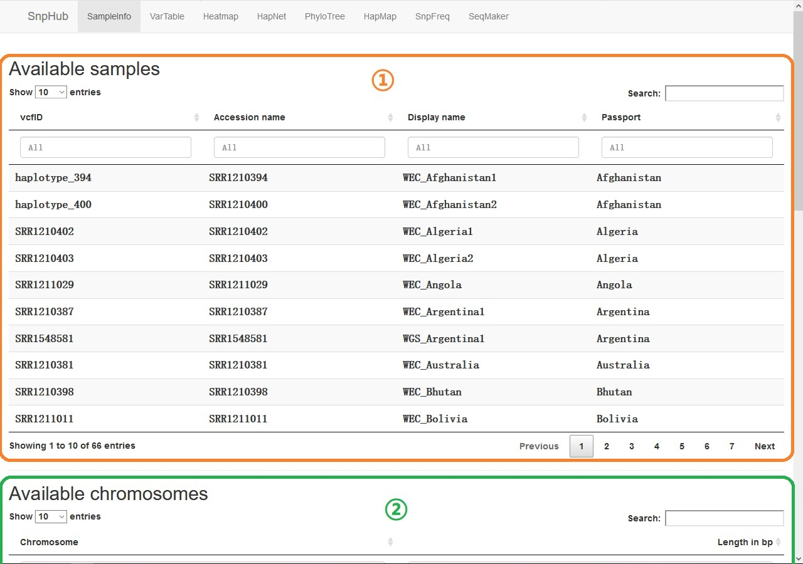
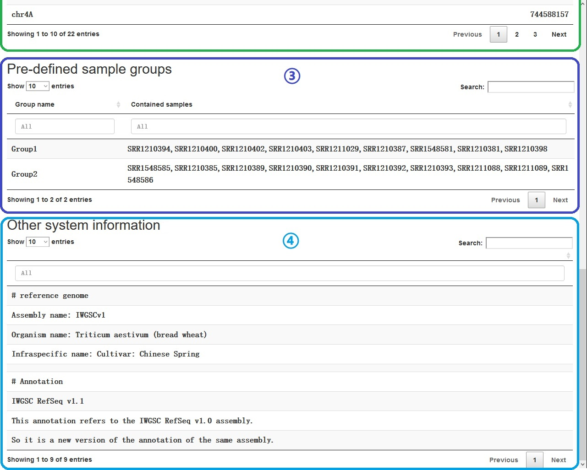
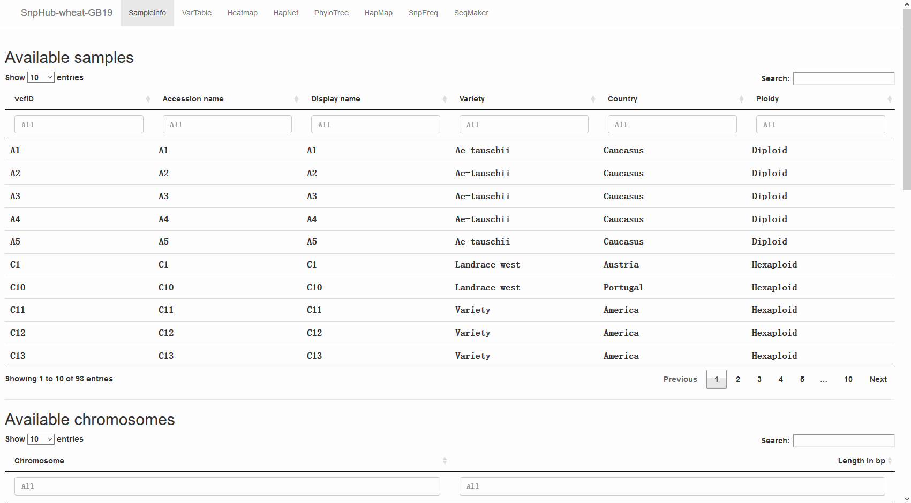

# Check Sample Info with SampleInfo

## Introduction with pictures and texts

`SampleInfo` is the functional channel, providing the sample description information for the data set, including ① samples ID tables, ② chromosome informations, ③ predefined sample groups, and ④ other system information.

- ①: The **`Available samples`** table shows all the samples available in the current instance. Generally, the `Accession name` is usually simple and short for user to specify sample lists by filling into the text box, and the `Display name` is the readable name that will be shown on figures.
	- *To balance the requirements of convenience in management by server managers, and ease of querying and readability of the analysis result, SnpHub utilizes a triple-name/ID for a sample, which includes (a) the vcfID, (b) the Accession name and (c) the Display name.*
		- *(a) The vcfID is a string name that is the same as that provided in the VCF files, avoiding the modification of the original VCF files.*
		- *(b) The Accession name is usually a short name, such as “S01,S02,S03”, so that it can be easily typed in the input box for querying a list of samples.*
		- *(c) The Display name is designed as a readable name to be displayed in the results and figures so that researchers can conveniently interpret the result.*
		- *Arbitrary sample information such as sample passport or sample notes could be provided in additional columns.* 

- ②: The **`Available chromosomes`**  table shows the IDs of all the available chromosomes or scaffolds, as well as their length, which is the maximum limitation for specifying a valid queried region.

- ③: The **`Pre-defined sample groups`** table shows all the available pre-defined groups, which is maintained by the system manager. The pre-defined sample groups are usually widely-used by users, for example, “Experiment”, “Control”, “Cultivar”, “Wild”, “Landrace”, etc. Users can specifying the predefined groups by the Group name/GroupID, so as to saving the labor for texting.
	- For the "`Samples`" input box, adding a hashtag *(#)* before the group name is required, to distinguish it from sample accession names.
	- For the "`Groups`" input box, the group name can be specified directly. 
	- *More detailed usage see [overview section](/content/Basic_Usage/overview.html)*

- ④: The **`Other system information`** table shows more other meta-information for illustrating the dataset, which can be freely defined by the system manager. For example, the meta-information can include reference genome information, annotation information, details of raw data alignment, and data-using policy.

All tables are provided with flexible searching functions, for the conveniences to exploring long tables.

## GIF Demonstration

