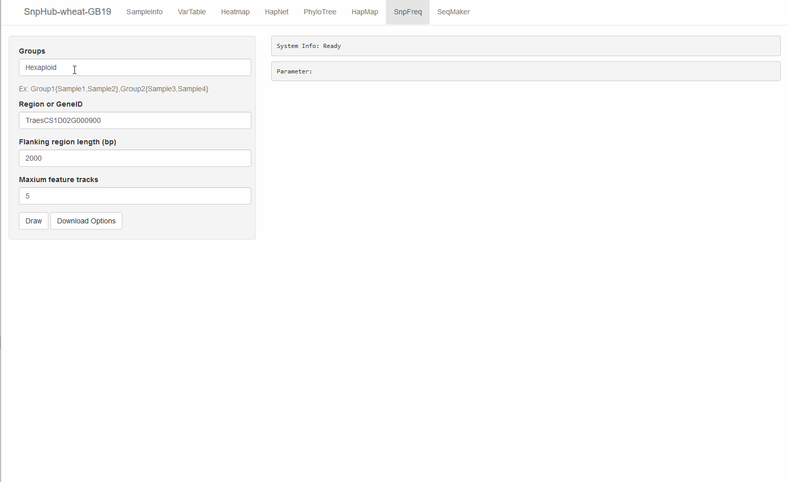

# SnpFreq

The **SnpFreq** function allows users to visualize the SNPs/INDELs and functional annotations along with the transcript-tracks. The previously proposed Lollipop graph is adopted to visualize the positions and frequencies of genomic variations to distinguish the low-frequency variants and un-detected variations.

Variants causing amino acid changes are annotated in different colours, including *missense variation*, *synonymous variant*, *frameshift variant*, *stop code gained/lost* and *splice region variants*. Transcripts in the same region are displayed as different tracks at the bottom, indicating the *exons*, *introns*, *CDSs* and *transcription directions*. Samples in different groups are summarized independently and visualized in different tracks, which can be useful for exploring the different frequencies of SNPs between groups.

## Panel ① on the left provides severial options:
- **Groups**: samples that divided into group(s) are wanted. Three ways are avaliable as well.
	- Pure sample name group list. Assume that we have samples `S1,S2,S3,S4`, and `S1,S2` are in a group called `G1`, while `S3,S4` in `G2`, a string like `G1{S1,S2},G2{S3,S4}` could be used as an input.
	- Pure group list. Assume that we have two pre-defined groups called `PG1` and `PG2`, a string like `PG1,PG2` could be used as an input.
	- Mixed list. String like `G1{S1,S2},PG1,PG2,G2{S3,S4}` is also able to use as an input.
	- **Make sure** that `S1`, `S2`, `S3` and `S4` should **NOT** be contained in neither `PG1` nor `PG2`.
	- **Make sure** that the samples in total should **NOT** less than 3, or the tree couldn't be built.

- **Region**: a region is wanted here. Input format should be `chr:from-to`, like `chr1A:1-100`. You could find all the avaliable chromsomes and their maximum length in `SampleInfo` panel. Also, gene name is acceptable.

- **Flanking region length**: when using the gene name as input, you may want some extra length in the upstream and downstream. Both ends of the region will be extended by the value here.

- **Draw**: click when getting all options ready.

## Download Options

Click the **Download Options** button, and then you can select format, width and height of the plot shown as the result. Then, click `Download` to download it.

## GIF Demonstration

