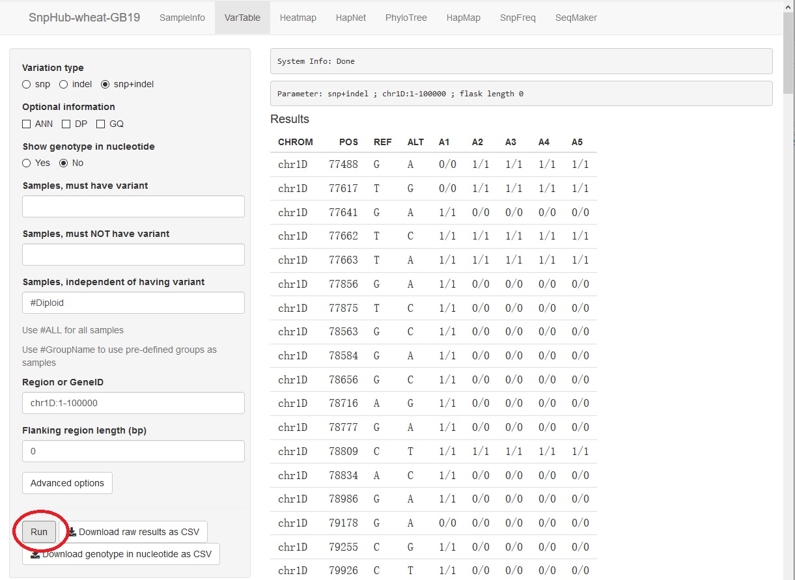
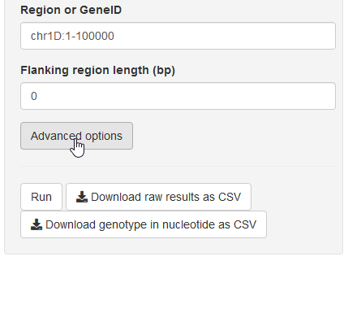
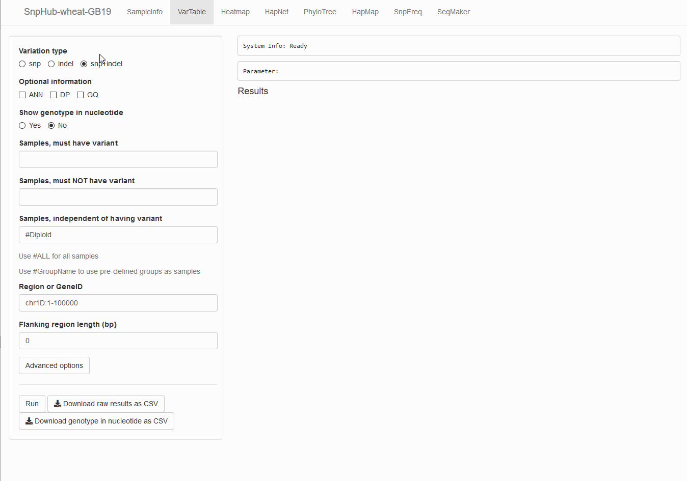

# VarTable, export region-specific variation tables

There are 2 panels in channel **`VarTable`**: the left one (①) is the input panel, and the right one (②) is the result display panel.

In the **`VarTable`** function, users can query gene-/region-specific SNP/INDEL tables for a list of samples. To be consistent with the VCF format, the exported genotypes are denoted as `0/0`, `1/1`, `0/1` or `./.`, representing the "same genotype with reference genome", "homozygous variant genotype", "heterozygous genotype", or "missing data", respectively.

**Note** that all the parameters for filtering sites are connected by **logic AND (&&)**

## Fill the parameters:

- **Variation Type**: select one of the three radio buttons that represent `SNP (Single Nucleotide Polymorphism) only`, `indel (insertion/deletion) only` or `SNP + indel`.

- **Optional information**: there are 3 check boxes, representing some meta-data that are stored in VCF format, which are the read depth (DP), genotype quality (GQ) and variant annotations generated by SnpEff (ANN). They could also be exported when the check boxes are checked. For more information about the mata-data, check the [vcf format document](https://samtools.github.io/hts-specs/VCFv4.2.pdf).

- **Samples**: The textbox titled "Samples" inquiry a sample list for querying. Three styles are supported for the sample-list input box, which are 
`list of sample names (Accession name according to the “SampleInfo” channel)`, `use group IDs with "#"` and `mixture`. For more details, please see [the overview section](https://esctrionsit.github.io/snphub_tutorial/content/Basic_Usage/overview.html). **VarTable** provides versatile functions for filtering variations among samples. Three types of sample-list input boxes with different functions are illustrated as following.
	- **List of samples, must have variant**: If sample is specified in this box, only sites with variance (different genotype as compared with REF) will be left. On the other hand, sites with same genotype or missing data will be filtered.
	- **List of samples, must NOT have variant**: When a sample is specified in this box, only site with the same genotype as reference or missing will be selected. Thus, the sites with variations will be filtered.
	- **List of samples, independent of having variant**: No filtering will be done specific for the samples listed in this box. Thus, this box is suitable for specifying samples as accompanies. Usually, users will prefer to only specify the sample list in this box, so as to show more information as possible.

- **Region or GeneID**: The textbox titled "**Region or GeneID** inquire the input for querying genomic regions. The input text shall be in form of `chr:from-to`. For example, `chr1A:1-100`. Also, gene name is acceptable.

- **Flanking region length**: When using the gene name as input, you may want to extend the regions. It is usually `0` bp in the box by default, indicating no flanking region is considered. If `2000` is provided in this input box, then the flanking regions in length of "2000bp" will be included for both upstream and downstream.

- **Advanced Options**: Click this button to show/hide advanced options. **Note** that when these options are hide, they **won't** do any filtering.

## RUN, and Download

Click the `Run` button when getting all options ready. A table for variations will be displayed on the right panel. Parameters and system messages, such as error message will be shown at top of the right panel.

Click `Download raw results as csv` to download current result table as `.csv` file.

Click `Download genotype in nucleotide as csv` to download a `.csv` file, contains the genotype in nucleotide.

## Advanced Options

Click the button `Advanced Options` to show more options.

**Note** that when these options are hide, they **won't** do any filtering. For example, if the parameter `MAF` was set as "0.5", then the user clicked `Advanced Options` button to hide the advanced options before clicking `Run`, the result won't be filtered by `MAF` because the advanced options are hidden.

- **Minimum allele frequency (MAF)**: Minor allele frequency (MAF) is the frequency at which the second most common allele occurs in a given population. Higher MAF threshold will result in fewer sites left. If the value is `0` (by default), this filter function is disabled, and no position will be filtered by MAF.

- **Biallelic sites only**: A **biallelic** site is a specific locus in a genome that contains two observed alleles, counting the reference as one, and therefore allowing for one variant allele. Generally, *SNP* is usually biallelic. A **multiallelic** site is a specific locus in a genome that contains three or more observed alleles, again counting the reference as one, and therefore allowing for two or more variant alleles. It is common that a *InDel* is multiallelic. Select `Yes`, all positions in the result that have multiallelic will be filtered, leaving only the biallelic positions.

- **Maximum missing rate**: For example, a maximum missing rate of 0.2 will filter sites with >20% samples with missing data. By default, this threshold is 0, indicating disable filtering for this function.

## Demonstration

